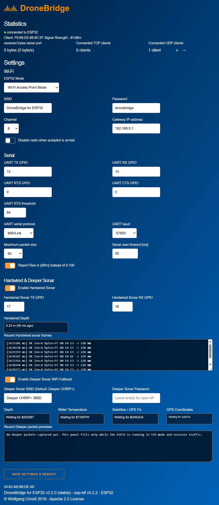

<p align="center">
  
</p>

# ESP32 Sonar Bridge

ESP32 firmware that bridges either a Deeper CHIRP+ Wi-Fi sonar or a hardwired GL04x-style UART sonar into MAVLink `DISTANCE_SENSOR`, built on top of DroneBridge ESP32.

## Why This Project Exists

This project replaces a split legacy setup with one ESP32:

- old Wi-Fi / MAVLink bridge on one microcontroller
- old hardwired sonar reader on a second microcontroller
- duplicated wiring, duplicated power, and duplicated maintenance

The goal is one board that can:

- read a hardwired underwater sonar
- optionally join a Deeper sonar over Wi-Fi
- publish depth to a flight controller over MAVLink
- keep a simple Web UI for configuration and live debug

## Current Capabilities

- Hardwired UART sonar reading at `115200 8N1`
- Deeper UDP/NMEA receive and parsing over Wi-Fi
- Boot-time source selection between Deeper and hardwired sonar
- MAVLink `DISTANCE_SENSOR` output to the flight-controller serial link and radio/TCP clients
- Web UI with sonar settings, depth panels, and debug views
- Bench logging and debug surfaces for both sonar paths

## Boot Behavior

If Deeper fallback is enabled, the firmware uses a one-shot boot policy:

1. The ESP gets one `60 second` boot-time attempt to join the configured Deeper SSID.
2. If it connects, Deeper becomes the only active sonar source for that boot.
3. If it does not connect, the ESP returns to DroneBridge AP mode, enables the hardwired sonar, and does not retry Deeper until the next reboot.

This avoids mixing both sonar sources during the same boot and makes bench testing more deterministic.

## Hardware Notes

- Target board: classic ESP32
- Default hardwired sonar pins:
  - ESP `GPIO17` -> sonar `RX` / trigger
  - sonar `TX` / data -> ESP `GPIO16`
- If the hardwired sonar `TX` line is `5V` TTL, level-shift it before the ESP32 `RX` pin.
- The hardwired UART protocol currently implemented follows the collected manufacturer reference:
  - trigger byte `0xFF`
  - frame format `FF Data_H Data_L SUM`

## Flight Controller Wiring

Current live bench-tested MAVLink UART settings:

- ESP32 `GPIO12` -> FC `RX`
- FC `TX` -> ESP32 `GPIO14`
- ESP32 `GND` -> FC `GND`
- `RTS = 0`, `CTS = 0`, so flow control is disabled
- serial protocol = MAVLink
- baud = `57600`

Practical notes:

- this FC link is separate from the hardwired sonar UART on `GPIO17` / `GPIO16`
- if the FC `TX` line is `5V` TTL, level-shift it before the ESP32 `GPIO14` input
- most flight controllers use `3.3V` UART, but verify before wiring

## Project Layout

- `firmware/` - ESP-IDF firmware, Web UI, and build configuration
- `HARDWIRED_SONAR_REFERENCE.md` - collected vendor notes for the hardwired UART sonar
- `CURRENT_DBG_CONTEXT.md` - detailed debugging handoff and development history
- `FINISH_TODO.md` - remaining work before calling the project stable
- `archive/` - local-only backups, probe logs, and historical artifacts; ignored by Git

## Build

This project uses ESP-IDF and CMake.

Typical flow:

```bash
cd firmware
idf.py set-target esp32
idf.py build
idf.py -p <PORT> flash
```

On Windows, a fully local build path is more reliable than building directly from a mapped or UNC path.

## Current Status

Bench validation completed:

- all four bench mode combinations were exercised:
  - both sonars off
  - hardwired only
  - Deeper only
  - both enabled, with Deeper winning when it connects during boot
- hardwired UART frames are parsed and converted to MAVLink `DISTANCE_SENSOR`
- Deeper UDP/NMEA data is parsed and converted to MAVLink `DISTANCE_SENSOR`
- saved AP credentials now remain stable in the Web UI even after a successful Deeper boot session
- Web UI sonar panels and debug views are live
- the earlier `httpd` and `Tmr Svc` stack overflows were fixed

Still open:

- longer soak/stability validation
- frontend polling / abort cleanup
- shutdown-time Deeper STA reconnect noise during intentional reboot
- real flight-controller end-to-end validation for both sonar sources

Known non-blocking quirk:

- some boot logs still print an ESP-IDF default AP startup line for `192.168.4.1`, even though the runtime AP remains on the configured `192.168.5.1`

See [FINISH_TODO.md](./FINISH_TODO.md) for the short list and [CURRENT_DBG_CONTEXT.md](./CURRENT_DBG_CONTEXT.md) for the detailed development log.

## Credits

- Based on DroneBridge ESP32
- Uses bench captures and vendor documentation for the hardwired sonar protocol
